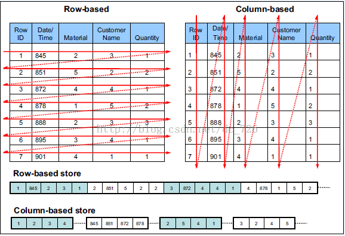

# orcdemo
ORC  use cases 、guied、 study materials、references

## 代码导航
- [SimpleOrcReader](https://github.com/aikuyun/orcdemo/blob/master/src/main/java/com/cuteximi/orc/SimpleOrcReader.java)
- [SimpleOrcWriter](https://github.com/aikuyun/orcdemo/blob/master/src/main/java/com/cuteximi/orc/SimpleOrcWriter.java)
## 什么是 ORC

ORC的全称是(Optimized Row Columnar)，ORC文件格式是一种Hadoop生态圈中的列式存储格式，它的产生早在2013年初，最初产生自Apache Hive，用于降低Hadoop数据存储空间和加速Hive查询速度。

和Parquet类似，它并不是一个单纯的列式存储格式，仍然是首先根据行组分割整个表，在每一个行组内进行按列存储。ORC文件是自描述的，它的元数据使用Protocol Buffers序列化，并且文件中的数据尽可能的压缩以降低存储空间的消耗，目前也被Spark SQL、Presto等查询引擎支持，但是Impala对于ORC目前没有支持，仍然使用Parquet作为主要的列式存储格式。2015年ORC项目被Apache项目基金会提升为Apache顶级项目。ORC具有以下一些优势:

- ORC是列式存储，有多种文件压缩方式，并且有着很高的压缩比。
- 文件是可切分（Split）的。因此，在Hive中使用ORC作为表的文件存储格式，不仅节省HDFS存储资源，查询任务的输入数据量减少，使用的MapTask也就减少了。
- 提供了多种索引，row group index、bloom filter index。
- ORC可以支持复杂的数据结构（比如Map等）
- 列式存储　　

由于OLAP查询的特点，列式存储可以提升其查询性能，但是它是如何做到的呢？这就要从列式存储的原理说起，从图1中可以看到，相对于关系数据库中通常使用的行式存储，在使用列式存储时每一列的所有元素都是顺序存储的。由此特点可以给查询带来如下的优化：

- 查询的时候不需要扫描全部的数据，而只需要读取每次查询涉及的列，这样可以将I/O消耗降低N倍，另外可以保存每一列的统计信息(min、max、sum等)，实现部分的谓词下推。
- 由于每一列的成员都是同构的，可以针对不同的数据类型使用更高效的数据压缩算法，进一步减小I/O。
- 由于每一列的成员的同构性，可以使用更加适合CPU pipeline的编码方式，减小CPU的缓存失效。

## 参考
https://www.cnblogs.com/ITtangtang/p/7677912.html

https://mp.weixin.qq.com/s/A6Kw9MjJFa6GCawGZZPwMA

https://mp.weixin.qq.com/s/b1xEXGYI5tyHO-KmNBP6Cw

https://cwiki.apache.org/confluence/display/Hive/LanguageManual+ORC

https://orc.apache.org/ 官网
